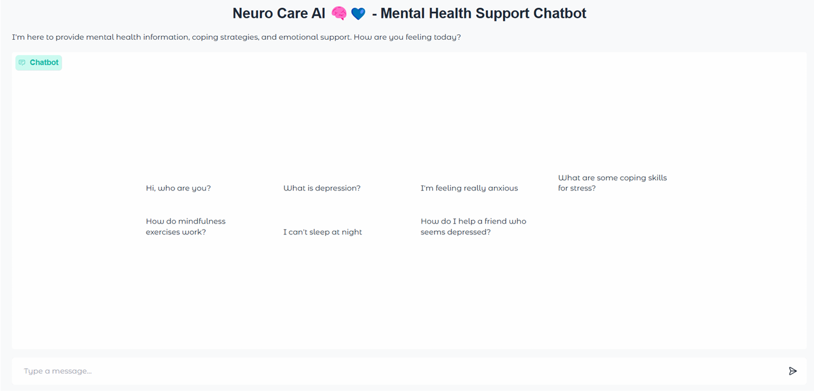
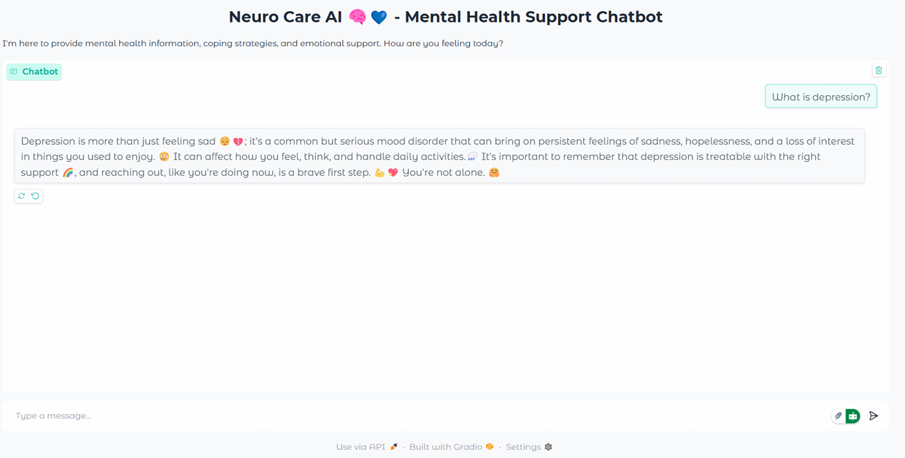
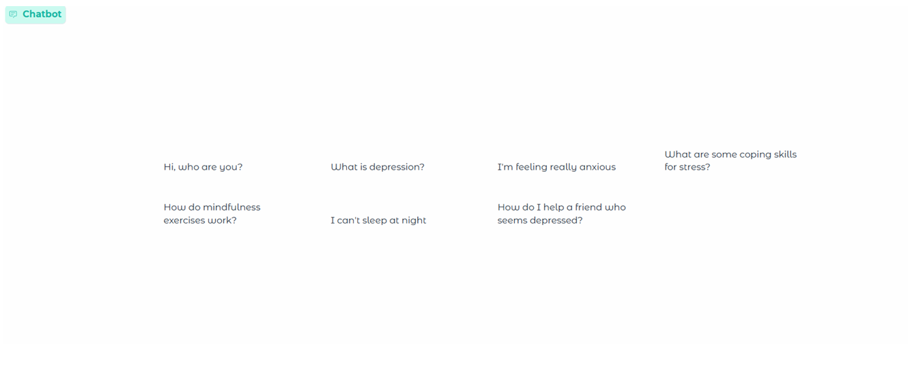

# Neuro-Care AI 🧠💙 
Mental Health Support Chatbot using Google Gemini API &amp; Gradio

**Neuro-Care** is a friendly AI-powered mental health chatbot designed to provide support, coping strategies, and information about mental wellbeing. While it’s **not a replacement for professional help**, it can guide users through gentle exercises, mindfulness techniques, and emotional support tips.

## 🌟 Features
- 💬 Interactive chatbot interface using **Gradio**  
- ❓ Supports **predefined mental health questions** and general prompts  
- 🧘‍♀️ Provides **coping strategies** for stress, anxiety, and sleep issues  
- 🏥 Offers **guidance on therapy, CBT, and professional help resources**  
- 🌈 Warm, friendly tone with **emojis for positive engagement**  

---

## 📸 Project Snapshots

### Chatbot User Interface


### Example User Prompt & Bot Reply


### Predefined Question Set


---

## 🛠️ Tech Stack
- **Languages:** Python  
- **AI/ML:** Google Gemini AI (Generative AI API)  
- **Interface:** Gradio  

---

## ⚡ Setup & Usage

### 1. Clone the repository
```bash
git clone https://github.com/Smriti579/Neuro-Care-Chatbot.git
cd Neuro-Care-Chatbot
````

### 2. Install Dependencies

```bash
pip install gradio google-generativeai
```

### 3. Set your Google API key

```bash
# Windows (Command Prompt)
setx API_KEY "YOUR_GOOGLE_API_KEY"

# Linux / macOS
export API_KEY="YOUR_GOOGLE_API_KEY"
```

### 4. Run the chatbot

```bash
python Neuro-Care-Chatbot.py
```

### 5. Open the Gradio interface and interact with the bot 🌟

---

## ⚠️ Notes

* This chatbot is for **educational and support purposes only**.
* Always consult a **mental health professional** for serious concerns.

---

## 🌐 Connect with Me

* [LinkedIn](https://www.linkedin.com/in/smriti-mahajan-68a505274/)
* [GitHub](https://github.com/Smriti579)
* [Email](mailto:smritimahajan579@gmail.com)
